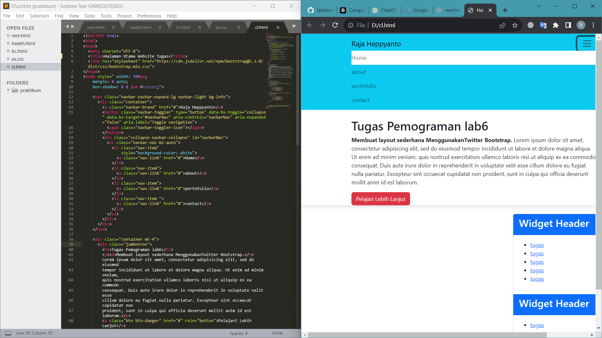
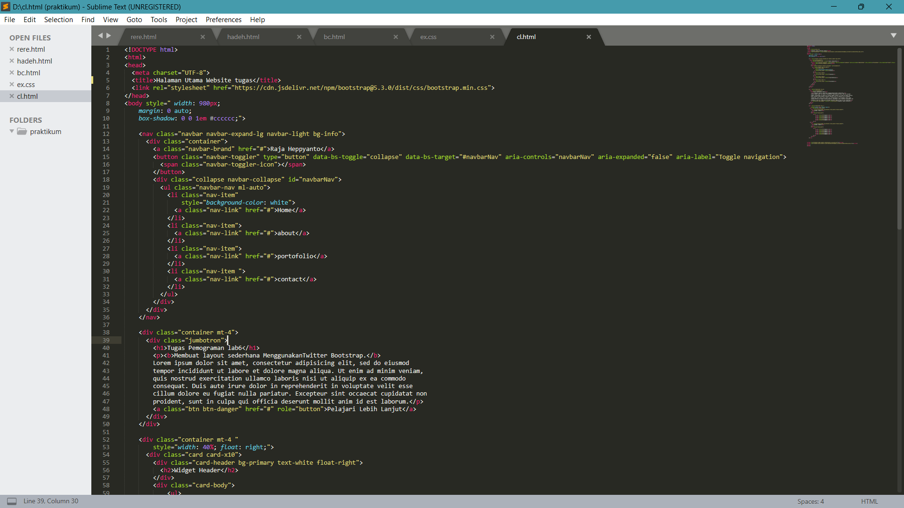
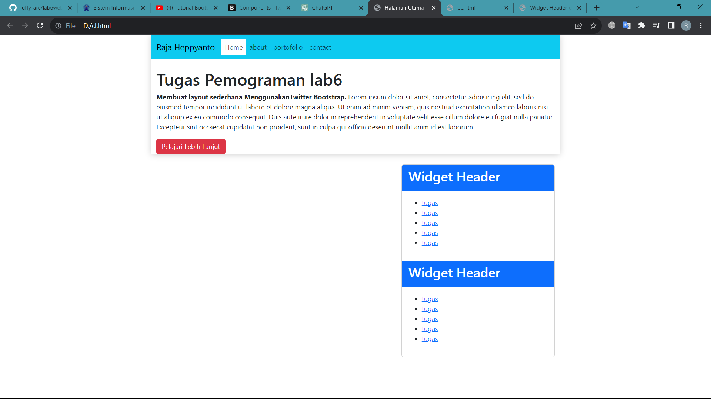
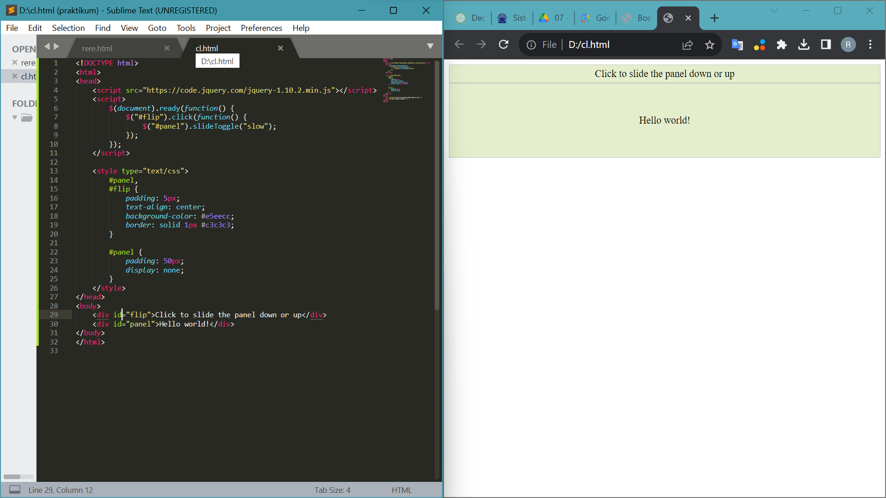
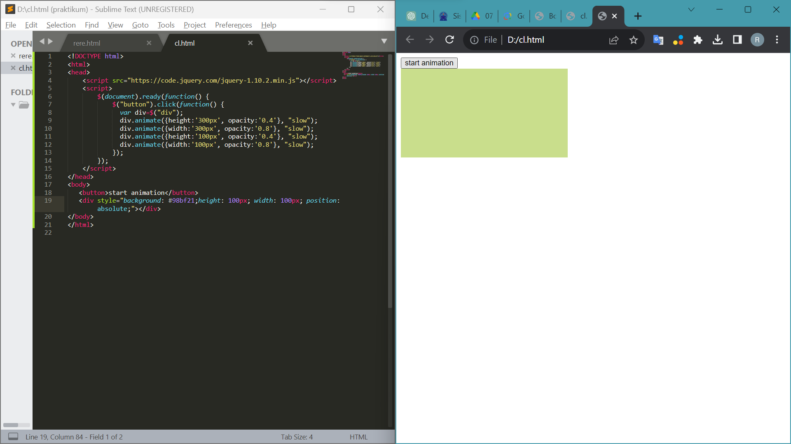
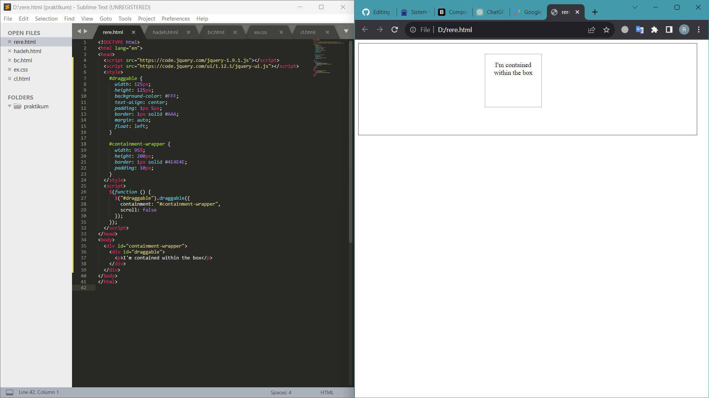

# lab6web
Tugas Pemograman pt 7

raja heppyanto

## Daftar 1si
```
1. tugas membuat layout sederhanan menggunakan css framework twitter bootstrap
2. mengerjakan latihan sesuai urutan
```

## 1. tugas membuat layout sederhanan menggunakan css framework twitter bootstrap
output + code

code

output


## 2. mengerjakan latihan sesuai urutan

jQuery Effect-sliding



jQuery Effect-Animation



jQuery ui Draggable


